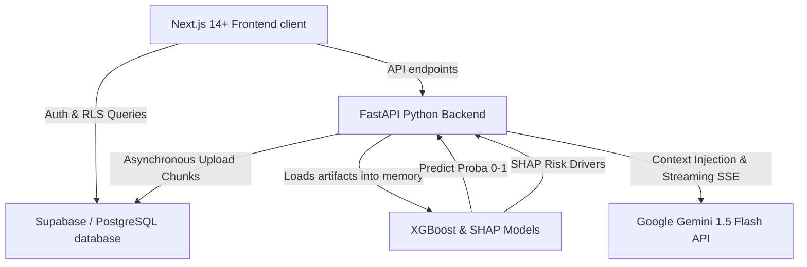

# Credit Default Risk Assessor (CDRA)

A commercial-grade, professional B2B credit risk command center designed for Risk Officers and credit analysts at Indian Banks/NBFCs. This platform automates the assessment of 6-month **Probability of Default (PD)** for credit card holders, integrating machine learning predictions, local explainability, and generative AI collection strategies.

---

## 🏗️ System Architecture



---

## ⚡ Key Features

1. **Portfolio Command Center**: A data-dense dashboard offering instant aggregates on Ingested Accounts, Weighted Portfolio PD, Average CIBIL Score, and total outstandings with interactive Recharts visual breakdowns (Bank and Card Network distributions).
2. **Customer 360 Risk Profile**: Deep-dive search engine displaying demographic bureau indexes, credit utilizations, 6-month behavioral timelines (Paid, MAD, Late, Missed), a 2-sentence Gemini risk narrative, and a bilateral SHAP contribution chart explaining exactly why the customer has their risk score.
3. **Smart Ingestion Hub**: Asynchronous uploading supporting 10,000 credit records. Automatically matches header synonyms case-insensitively, presents a schema column mapping dashboard, runs predictions in batch matrix format, and handles database writes under Row Level Security (RLS) policies.
4. **Collections Strategist**: Proposes targeted credit collections strategies based on Probability of Default (PD) bands (Low, Medium, High) streamed via Server-Sent Events (SSE).
5. **Regulatory Simulator Chat**: A B2B chatbot console pre-injected with Reserve Bank of India (RBI) risk weights directives (e.g. the 25% credit card receivables hike) and live portfolio aggregates to run compliance "What-If" scenarios.

---

## 🛠️ Technology Stack

- **Frontend**: Next.js 14 (App Router), TypeScript, Tailwind CSS, Zustand, React Query, Recharts.
- **Backend**: Python (FastAPI), Uvicorn, Pandas, Scikit-Learn.
- **ML Engine**: XGBoost Classifier (ROC AUC: 88.36%), SHAP (TreeExplainer).
- **Database & Auth**: Supabase (PostgreSQL), Row Level Security (RLS).
- **GenAI**: Google Gemini 1.5 Flash (Google AI Studio).

---

## ⚙️ Local Setup and Installation

### 1. Database Setup
Create a new project on [Supabase](https://supabase.com) and execute the SQL migration script:
- Copy the contents of [`backend/scripts/schema.sql`](file:///c:/Credit%20Risk%20Assessor/backend/scripts/schema.sql) and run it inside the Supabase SQL Editor.

### 2. Backend Configuration
1. Navigate to the backend directory:
   ```bash
   cd backend
   ```
2. Create a `.env` file referencing your project URL, keys, and Gemini API key (copied from [`backend/.env`](file:///c:/Credit%20Risk%20Assessor/backend/.env)):
   ```env
   SUPABASE_URL=https://your-project.supabase.co
   SUPABASE_KEY=your-supabase-anon-key
   SUPABASE_SERVICE_ROLE_KEY=your-supabase-service-key
   GEMINI_API_KEY=your-gemini-key
   MODEL_PATH=app/ml/model.joblib
   EXPLAINER_PATH=app/ml/explainer.joblib
   ```
3. Run the FastAPI development server:
   ```bash
   uvicorn app.main:app --reload
   ```

### 3. Frontend Configuration
1. Navigate to the frontend directory:
   ```bash
   cd ../frontend
   ```
2. Setup environment keys (referencing [`frontend/.env.local`](file:///c:/Credit%20Risk%20Assessor/frontend/.env.local)):
   ```env
   NEXT_PUBLIC_SUPABASE_URL=https://your-project.supabase.co
   NEXT_PUBLIC_SUPABASE_ANON_KEY=your-supabase-anon-key
   NEXT_PUBLIC_API_URL=http://localhost:8000
   ```
3. Launch the Next.js development server:
   ```bash
   npm run dev
   ```

---

## 🚀 How to Demo

1. **Sign In**: Open `http://localhost:3000` in your browser. Request access or sign in using a demo email (or use default mock session bypasses).
2. **Review Empty Dashboard**: Notice the placeholder statistics showing exposure metrics on the main Overview tab, ensuring a beautiful initial layout with zero empty states.
3. **Upload Bureau Portfolio**:
   - Go to **Portfolio Upload**.
   - Select the generated demo file [`backend/data/indian_credit_portfolio_demo.csv`](file:///c:/Credit%20Risk%20Assessor/backend/data/indian_credit_portfolio_demo.csv).
   - Review the **Schema Column Mapper** which auto-detects column names.
   - Click **Confirm and Start Ingest** and monitor the live progress bar.
4. **Explore Overview Metrics**: Navigate back to **Overview** to see the chart visual segmentations update instantly using the newly uploaded 10k rows.
5. **Customer 360 Search**:
   - Go to **Customer 360** and search for an ingested ID (e.g. `IND100002` or `IND100003`).
   - Deep-dive into CIBIL score gauges, credit utilization scales, payment history blocks, the top 3 SHAP drivers showing exactly why their default risk rose or fell, and the 2-sentence Gemini narrative.
6. **Collections Strategist**: Click the collections navigator shortcut to stream the collections response and EMI recommendations.
7. **Compliance Chat Simulator**:
   - Navigate to the **Regulatory Simulator Chat**.
   - Click a prompt preset (e.g. the 25% RBI risk weight hike query) and watch the chatbot stream a compliance report, analyzing your portfolio's outstanding exposure and CAR impact.
